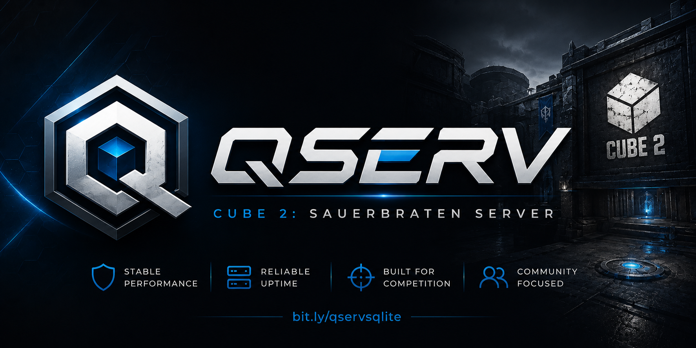

<div align="center">

 [](https://github.com/deathstar/qserv2020/wiki/)


</div>

---

## Overview

QServ is a standalone Cube 2: Sauerbraten server written in C and C++ that significantly expands the capabilities of the original dedicated server.

Unlike traditional server modifications, QServ separates its command system from the core server implementation, making upgrades, maintenance, and feature development far easier. The result is a highly customizable, cross platform, feature-rich server platform that has evolved over more than 17 years of development.

Whether you're running a public server, competitive clan server, private community, or custom game mode, QServ provides powerful administration tools, persistent player statistics, automated content delivery, browser-based management, and extensive gameplay enhancements.

---

## Why QServ?

- Persistent SQLite-backed player statistics
- Saved player stats and ranking webserver
- Browser-based administration
- Mobile phone administration through IRC
- Automatic custom map distribution
- Advanced moderation tools
- Extensive gameplay customization
- Multi-server chat linking
- Geolocation services
- SmartBot utilities
- Live configuration reloading
- Cross-platform support
- Easy-to-extend command architecture

---

# ✨ Features

## 📊 Statistics & Database

- SQLite-backed player database
- Lifetime player statistics
- Persistent player records
- End-game statistics
- Stored flagrun records
- Full database integration

## 🛡️ Administration & Moderation

- 40+ administrative commands
- Permanent bans
- IP bans
- Selective unbanning
- Banlist management
- Live authkey reloading
- Live configuration reloading
- Admin IP visibility
- Browser-based administration
- Mobile administration
- Call-admin functionality
- Anti-spam protection
- Server overload protection

## 🌎 Networking & Community

- IRC bot integration
- IRC administration commands
- Multi-server chat linking
- GeoIP geolocation
- HTTP geolocation support
- Country detection
- State and region detection
- City detection
- SmartBot IRC integration
  - Weather
  - Translator
  - Dictionary
  - Calculator

## 🎮 Gameplay Modules

### Teamplay

- Heal teammates by shooting them
- Pass flags to teammates by shooting them
- Persistent teams option
- Clan war mode

### Combat

- Killing spree messages
- Longshot awards
- Close-range kill awards
- No-damage mode

### Server Experience

- Welcome messages
- Banner announcements
- Custom bot names
- Lag detection
- Private mode toggle
- Default gamemode selection
- Default map selection
- Administrator call system

## 🗺️ Custom Maps & Content Delivery

One of QServ's most unique features.

- Instagib support on custom server maps
- Server-stored maps
- Automatic map downloading
- Automatic lightmap delivery
- Browser-controlled map management
- Server-side content distribution

Players can join a server and automatically receive custom maps directly from the server without requiring external downloads.

## 🔧 Development Features

- Modular command architecture
- Server command builder
- Easy custom command creation
- C helper functions
- C++ helper functions
- Reloadable configuration system
- Feature module support
- Designed for long-term maintainability

---

# ⚡ Quick Setup

## Windows

1. Configure your server:

```text
config/server-init.cfg
```

2. Forward the following UDP ports to the internal IP address of your server host:

```text
28785
28786
```

3. Download one of the up to date binaries from the releases section: https://github.com/deathstar/QServSqlite/releases, unzip it and run:

```text
qserv.exe
```

## Linux / macOS

Configure:

```text
config/server-init.cfg
```
Forward the following UDP ports to the internal IP address of your server host:

```text
28785
28786
```
Download one of the up to date binaries from the releases section: https://github.com/deathstar/QServSqlite/releases, unzip it and run:

```bash
./qserv
```

Or run the server in background:

```bash
nohup ./qserv &
```

---

# ⚙️ Configuration

## Main Server Configuration

```text
config/server-init.cfg
```

Contains:

- Server name
- Passwords
- Gameplay settings
- IRC configuration
- Geolocation settings
- Module configuration
- Default maps and gamemodes

## Authentication Keys

```text
config/users.cfg
```

Contains administrator and authentication keys.

## Linux/macOS Permissions

Allow QServ to access its configuration files:

```bash
chmod -R 777 config
```

Optional map storage support:

```bash
mkdir -p packages/base
chmod -R 777 packages
```

---

# 🌐 Statistics and Player Ranking Webserver

To host a website that displays player statistics from the server and ranks them, you can use the included webserver.

Install python:
  
```text
sudo apt install python3 python3-pip -y
```

Forward port using TCP to the internal IP of the QServ host server:
  
```text
8080
```

Start the webserver:

```text
nohup python stats-webserver.py &
```

Visit your website:

```text
http://YourExternalIPAddress:8080
```

---

# ⬆️ Upgrading

To upgrade your existing QServ server, but keep your existing configuration:

- Copy and back up your existing config folder and playerinfo.db file to a safe temporary location.
- Delete your old QServSqlite folder.
- Download and extract the new version of QServSqlite.
- Move your backed-up config folder and playerinfo.db file into the new QServSqlite folder, overwriting the default files.

---

# 🏗️ Building From Source

If you want to modify commands, gameplay mechanics, server features, or contribute to development, you'll need to compile QServ from source.

## macOS Requirements

### Xcode

Install Xcode from the App Store.

### Command Line Tools

```bash
xcode-select --install
```

### CMake

Download from:

https://cmake.org/download/

## Linux Requirements

### Ubuntu / Debian

```bash
sudo apt-get install build-essential
sudo apt-get install cmake
sudo apt-get install zlib1g-dev
sudo apt-get install libsqlite3-dev
```

## Unix Compilation

Clone the repository:

```bash
git clone https://github.com/deathstar/QServSqlite
cd QServSqlite
```

Compile:

```bash
cmake .
make
```

Run:

```bash
./qserv
```

Run in background:

```bash
nohup ./qserv &
```

View background log:

```bash
nano nohup.out
```

Stop the server:

```bash
CTRL+C
```

or:

```bash
kill PID
```

## Windows Compilation

Install MSYS2:

https://www.msys2.org/

Update packages:

```bash
pacman -Syu
```

Install dependencies:

```bash
pacman -S mingw-w64-x86_64-gcc mingw-w64-x86_64-cmake mingw-w64-x86_64-make git mingw-w64-x86_64-sqlite3
```

Clone:

```bash
git clone https://github.com/deathstar/QServSqlite
```

Build:

```bash
cmake .
cmake --build .
```

The executable and source code will be located under:

```text
C:\msys64\home\<username>
```

---

# ❓ Troubleshooting

## Master Server Registration Failed

```text
Failed Pinging Server
```

In addition to forwarding ports 28785 and 28786 using UDP to the internal IP of the QServ host server, you will need to
completely ensure that your firewall is open. You can set UFW rules on Linux, turn off your firewall in OSX settings (100% necessary)
or create an inbound and outbound rule in Windows defender. This ensures that the port is open to the internet. If you are 
using an alternative port, make sure that you also forward serverport+1 as a range, not just one port. 

## LAN Server Info Socket Error

```text
WARNING: could not create LAN server info socket
```

The LAN info socket is only used for local network server visibility and does not affect internet players.

If the server info socket fails, the port is likely blocked by a firewall. QServ utilizes the following ports:
- 28784 for LAN server info socket (serverport-1)
- 28785 for the server socket (serverport)
- 28786 for master server keepalive pings (serverport+1)

## Modern CMake Compatibility Error

```text
Compatibility with CMake < 3.5 has been removed
```

Use:

```bash
cmake . -DCMAKE_POLICY_VERSION_MINIMUM=3.5
```

or update:

```cmake
cmake_minimum_required(VERSION 3.5)
```

## Geolocation Not Working

Switch to GeoIP geolocation:

```text
httpgeolocation 0
```

Also verify file permissions:

```bash
chmod -R 777 qserv
```

## Flagruns Not Saving

Ensure QServ can write to its files:

```bash
chmod -R 777 qserv
```

## IRC Bot Not Connecting

Possible causes:

- `ircignore` is enabled
- IRC flood protection triggered
- IRC server outage
- Too many reconnect attempts

Try a different IRC server.

## Segmentation Fault

Please create a GitHub issue and include:

- Operating system
- Crash logs
- Steps to reproduce

Optional debugging:

```bash
gdb ./qserv
```

or

```bash
lldb ./qserv
```

## Missing Libraries

Common missing dependencies:

- SQLite
- Zlib
- ENet
- GeoIP

Install them manually if automatic detection fails.

---

# 📚 Documentation

For information about:

- Creating commands
- Modifying gameplay
- Extending QServ
- Server administration
- Feature development

Visit the Wiki:

https://github.com/deathstar/qserv2020/wiki

---

# 🤝 Contributing

Contributions, bug reports, feature requests, pull requests, and documentation improvements are welcome.

QServ has grown through community contributions over many years, and every improvement helps make the project better.

---

# 📧 Support

For development questions, server support, or general inquiries:

**George Scott**

gscottmalibu@gmail.com

---

# 📜 License

MIT License

Copyright (c) 2026 George Scott, Stephen Caples, Jonlimle, Andrius4669, Eric Zeiger, Mihai Draghicioiu, BudSpencer, Zer0TraceX, Lorenzo Pistone

QServ has evolved through more than 17 years of development and contributions from many members of the Cube 2: Sauerbraten community. Numerous features were inspired by or adapted from other Sauerbraten server projects and combined into a single feature-rich platform. Credit is given to everyone who helped make this project possible.

Permission is hereby granted, free of charge, to any person obtaining a copy of this software and associated documentation files to deal in the Software without restriction, including without limitation the rights to use, copy, modify, merge, publish, distribute, sublicense, and/or sell copies of the Software.

THE SOFTWARE IS PROVIDED "AS IS", WITHOUT WARRANTY OF ANY KIND, EXPRESS OR IMPLIED, INCLUDING BUT NOT LIMITED TO THE WARRANTIES OF MERCHANTABILITY, FITNESS FOR A PARTICULAR PURPOSE AND NONINFRINGEMENT.
